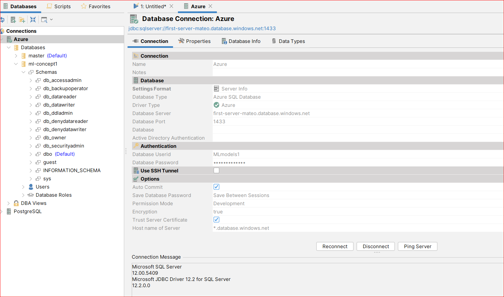
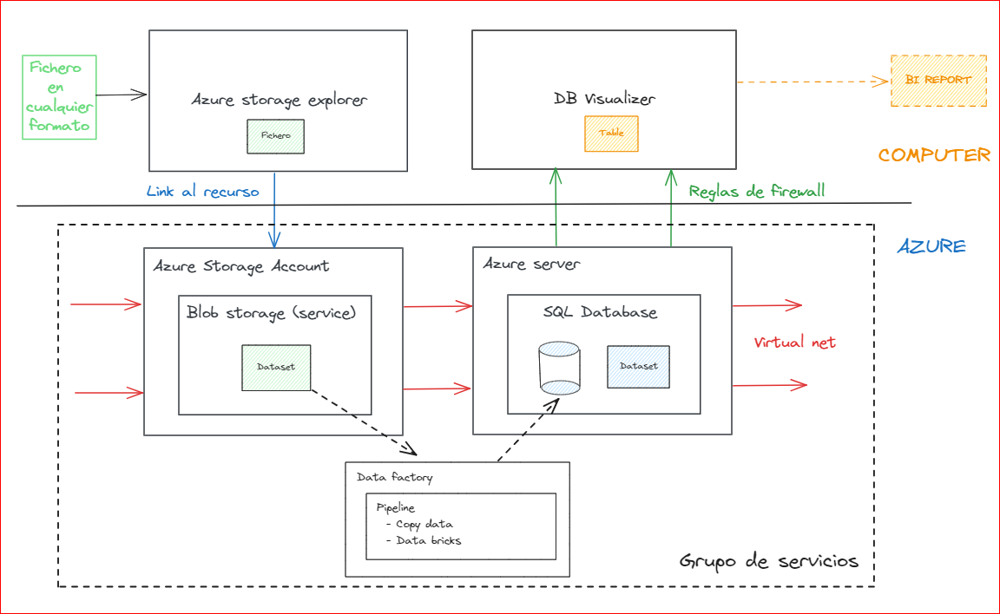

## Set up proxy :rocket:
--------------------
* set HTTPS_PROXY=http://es001-surf.zone2.proxy.allianz:8080
* set HTTP_PROXY=http://es001-surf.zone2.proxy.allianz:8080
* set PROXY_USER=eXXXXXX
* set PROXY_PASSWORD=pwd :

## Install environment 
----------------------
* conda env create -p .\venv -f .\bin\local\environment.yml :relaxed: 

## Github 
----------------------
* git checkout name_rama_interes_remoto **Cambia de rama en el repo local**
* git merge name_rama_remoto  **Fusiona la rama remota con la rama local actual**
* git push origin name_rama_actual_local:name_rama_remota **Hace push de la rama local a la rama remota**
* git add file_name **Agregar un fichero específico antes de un commit**
* git add . **Agrega todos los cambios ante de un commit**
* git commit -m "Mensaje descriptivo del commit" **Crea un commit con ese mensaje**
* git fetch origin **Actualiza el repositorio local, pero no actualiza los ficheros automaticamente**
* git pull origin name_rama_remota **Actualiza inmediatamente el repo local con la rama especificada**

**Gestión de issues y pull request:**

1. Generar un issue en la página web de github
2. Trabajar los cambios sobre la rama que gestionará el issue
3. Agregar los ficheros modificados con el comando git add
4. Hacer commit pero es muy importante incluir en el comentario el número del issue EX: "Resuleve #10" si el issue es el 10
5. Hacer push sobre tu rama (la rama encargada del issue)
6. Crear la pull request (base: Main) (compare : rama encargada del issue)
7. El revisor se encargará de validar que los cambios propuestos estan ok y entonces aceptará cambio y guardara la pull request.

## Creando los primeros servicios en Azure

1. **Garantizar que tiene una cuenta de Microsofot activa**
2. Crear un grupo de recursos.
3. Crear un datafactory / fabrica de datos asignandole el grupo de recursos que creó en el punto 2.
4. Crear una cuenta de almacenamiento / storage account. Recuerde que dentro de una cuenta de almacenamiento puede crear:
    - Blob storage
    - Azure files
    - Azure queues
    - Azure tables
5. Crear un blob storage dentro de la cuenta de almacenamiento. 
6. Instalar Azure storage explorer.
7. Vincular la cuenta de almacenamiento al Azure storage explorer, para hacerlo deberá suministrar un key access,
ese acceso se encuentra en la web de azure -> nombre de la cuenta de almacenamiento -> panel izquierdo -> seguridad
y redes-> claves de acceso -> puede usar la key1 o a key 2
8. Agregue los ficheros y cree las carpetas segun lo necesite en el azure storage explorer y valide que se ven en la web.
NOTA: cada vez que cargue un fichero valide que este se carga con acceso de uso frecuente. 
9. Crear una red virtual / virtual net si es que la empresa no la tiene (Este trabajo es de un arquitecto).
10. Crear un servidor, y en el panel izquierdo -> redes, valida que tienes:
    - Acceso de red publica -> redes seleccionadas.
    - Redes virtuales -> Agrega la virtual net que creaste previamente
    - En reglas de firewall -> agrega todas las que sean necesarias segun tu interacción con la conección en db visualizer y/o azure
11. Crea una base de datos de SQL. -> configura acceso de red al servidor (requiere la virtual net y el servidor)
12. Instala DBvisualizer:
   - Create new data base connection
   - Para realizar la conección busca la info en el panel central, en la parte superior dentro de la base de datos SQL
   - Haz click sobre cadenas de conexión -> mostrar las cadenas de conexión de la base de datos.
   - Utiliza esa información para conectarte. 

## Creando un primer ETL en data factory

1. En db visualizer, dentro de la base de datos crea una tabla con el comando create table de SQL. 
2. Carga el fichero que tiene las columnas del create table en el azure bolb storage (utiliza en explorador).
3. Dentro del data factory crea un pipeline / canalización que se llame blob_to_sql
4. Agrega un nuevo conjunto de datos (Dataset) / conexiones (desde el panel izquierdo)
   - selecciona blob storage -> formato del fichero que necesites-> revisa con la opción de preview que se cargo correctamente.
5. Agrega un nuevo conjunto de datos (Dataset) / conexiones (desde el panel izquierdo)
   - selecciona Azure SQL database-> vincula el servicio de base de datos SQL que creaste -> revisa que se haya creado la tabla vacia.
6. Parate sobre el pipeline que creaste y en la lupa busca copy data /copiar datos, arrastra este elemento al panel
7. Asigna como origien el data set del fichero y como destino la base de datos.
8. Prueba a crear una tabla de logs, que te permita revisar fecha de entrada de los datos. (Opcional)
9. Ejecuta el pipeline, y en caso de que todo este correcto publicalo.

## See: 
https://www.youtube.com/watch?v=EpDkxTHAhOs

## Developers
----------------------
The developers responsible for the development and maintaining of this project.

* **Julian Caro** - *Author/Maintainer* - [mateocivil10@gmail.com](https://github.developer.allianz.io/jesusmanuel-sono)

